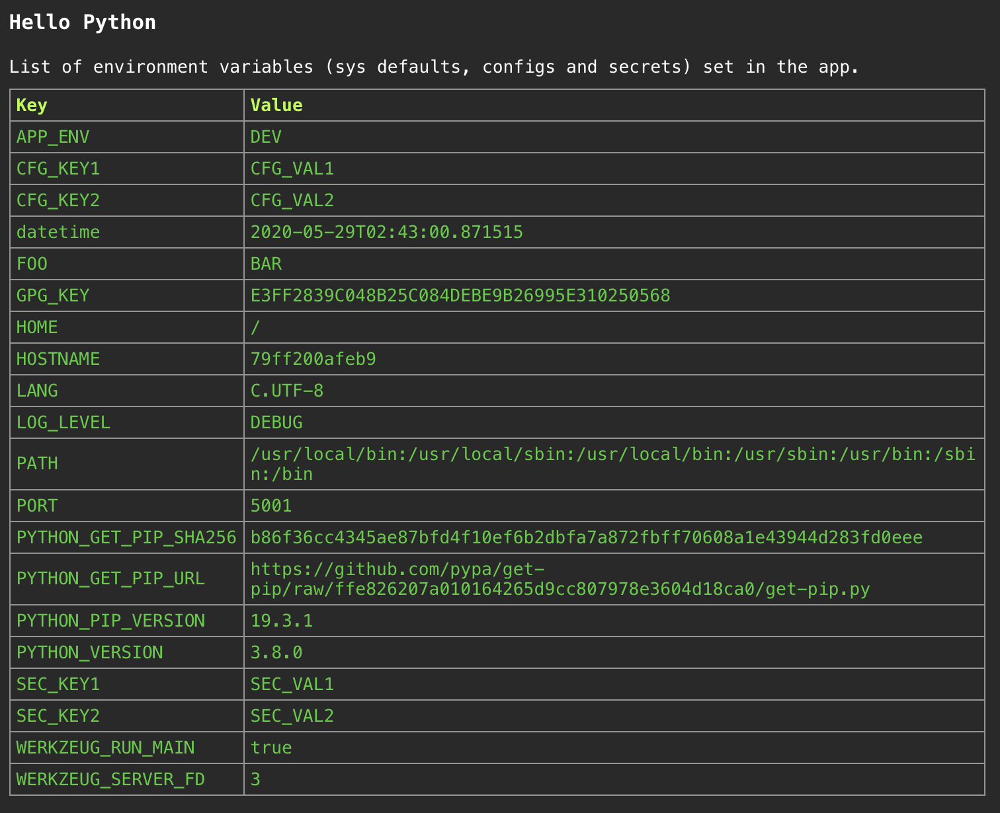

# Sample containerized Python application

This repo contains a sample application to deploy to Kubernetes. The application is a simple HelloWorld app using Python and Flask framework.

## Run with Docker

```bash
$ docker build -f Dockerfile -t hello-python:latest .

$ docker run -it -p 8080:8080 --name hello_python hello-python:latest

# Docker Docs: https://docs.docker.com/
# Docker Reference: https://docs.docker.com/reference/
```

## Run with Docker Compose

```bash
$ docker-compose up hello_py_devl && docker-compose rm -fsv

# For additional instruction please see notes at the bottom
# of docker-compose.yml file in the app root directory.

# Docker compose docs: https://docs.docker.com/compose/
```

## Run with Python

System Requirements: [Git](http://www.git-scm.com), [Python 3.8.0](https://www.python.org/downloads/)

```bash
# Check dependencies
$ git --version
git version 2.23.0

$ python --version
Python 3.8.0

$ pip --version # pip comes as a part of python install
pip 20.0.2 from /usr/local/lib/python3.8/site-packages/pip (python 3.8)

# Clone the sourcecode
$ git clone <repo url>
$ cd <project dir>

# Install project dependencies
$ pip install -r requirements.txt

# Run the application
$ PORT=8080 python src/app.py

# Check application
$ curl http://localhost:8080/debug
# (or)
# In Browser visit -> http://localhost:8080/debug/ui
```

## Sample output

Pointing your browser to <http://localhost:8080/debug/ui> will bring up the following:


